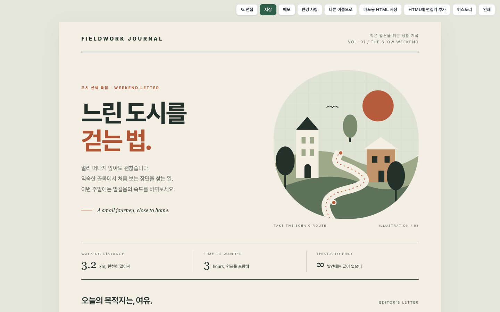
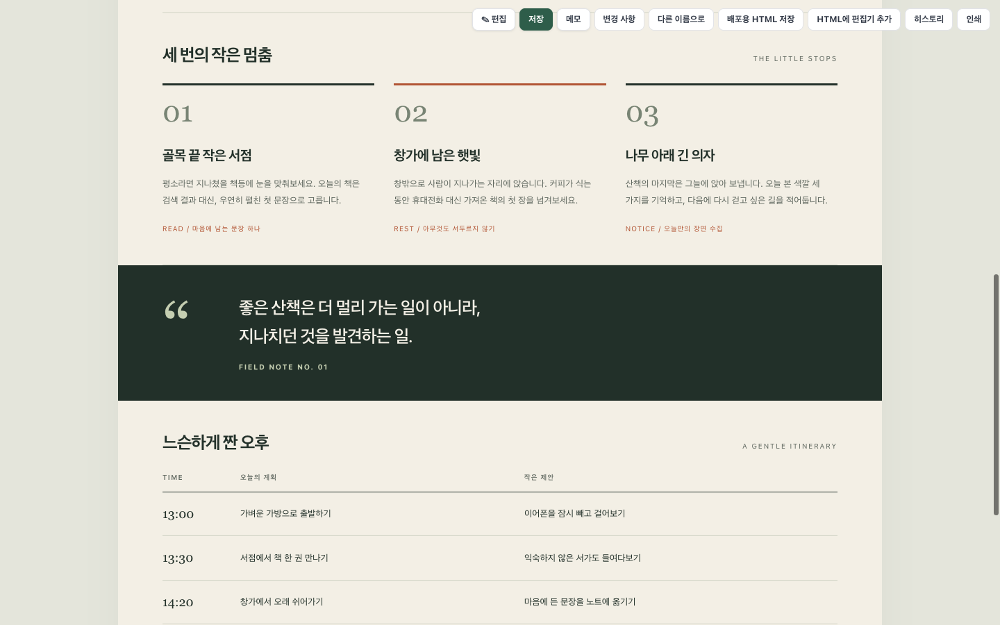
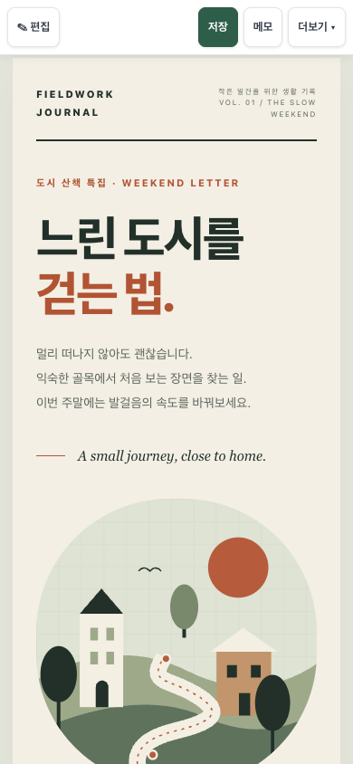
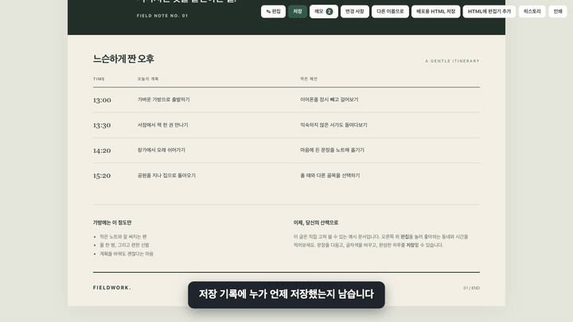
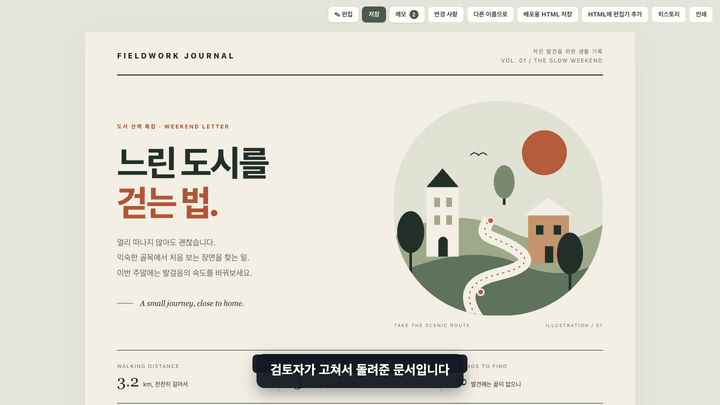
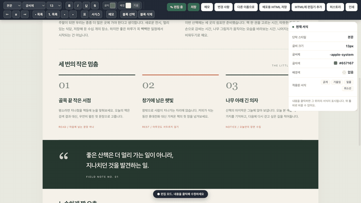

# HTML Doc

**A document editor that fits in a single HTML file.** Open the file, edit the text and formatting in the browser, and save back to the same file. No server, no account, no install.

[한국어](README.md) · [Agent instructions](SKILL.md) · [Korean reference](references/guide.ko.md) · [Latest release](https://github.com/tonywjs/html-doc/releases/latest)



**Current release: 1.7.0.** Agent instructions are in English, with a Korean reference. The editor and conversion-tool UI are currently **Korean**; document content can be in any language.

## Try it in a minute

1. Download [demo.html](https://github.com/tonywjs/html-doc/releases/latest/download/demo.html).
2. Open it in a browser. A double click is enough.
3. Press **✎ 편집** (edit) at the top right and change any sentence.
4. Press **저장** (save). You pick the destination file once; after that it overwrites the same file.

Already have an HTML file? Download [add-editor.html](https://github.com/tonywjs/html-doc/releases/latest/download/add-editor.html), open it, and choose your file to get an editable copy.

## What the documents look like

The document design is entirely yours. Below is the bundled example (`examples/demo.html`); the editing features sit on top without touching the design.

| Desktop | Mobile |
|---|---|
|  |  |

## Features

### Notes: keep the reasoning inside the document

Select text and write a note; it anchors to that spot. Reply to it, mark it resolved, or delete it. With no selection, the note applies to the whole document.



Notes live **inside the file**, so they travel with it. They are dropped from the read-only export.

### Changes: see what came back edited

Compare the body against a saved version or another HTML file, and see the difference laid over the document. Green is an addition, red a deletion, blue a word-level edit, purple a formatting change.



Pick the baseline from three sources: the state at the last save, a saved version in the file's history, or another HTML file. The default is **the most recent version saved by someone other than you**, so a returned document shows exactly what the other person changed. **원래대로** reverts a single change.

### Block deletion: remove a whole chunk

Delete a paragraph, a card, or a table row as one piece. **블록 선택** outlines the target (press again to widen to the parent block), **블록 삭제** removes it, and the toast's **되돌리기** or `Ctrl/Cmd+Z` brings it back.



Deleting from a table cell removes the **whole row**, because dropping one cell breaks the column alignment. The engine avoids the browser's own delete for the same reason: that path merges the deleted block into its neighbour and the surviving block loses its styling.

### The whole flow

To watch opening a returned document, reviewing the changes, reverting one, and trading notes in one take, see the [full walkthrough (28 seconds)](docs/media/walkthrough.mp4).

## How to use it

### Editing and saving

| Goal | How |
|---|---|
| Toggle editing | **✎ 편집** at the top right, or `Cmd/Ctrl+E` |
| Change text and formatting | The toolbar: paragraph style, font, size, bold/italic/underline/strikethrough, text and background colour, alignment, lists, tables |
| Inspect formatting at the caret | The **현재 서식** panel |
| Save | **저장** or `Cmd/Ctrl+S` |
| Save elsewhere | 더보기 → **다른 이름으로** |

In supported browsers (Chrome, Edge and friends) you choose the destination file **once**. After that it overwrites the same file, though the browser may ask to renew write permission. Browsers without File System Access (Safari, Firefox) fall back to a download.

### Autosave and recovery

Typing leaves a backup inside the browser, separate from the file. If you close without saving and reopen, a recovery prompt appears: **복구** restores the backup into the body, **무시** dismisses it for now, and **무시하고 현재 버전으로 백업 확정** replaces the old backup with the current body.

The first save gives the document an ID so backups are keyed per document. Files that share a name no longer share a backup, and a backup made from a different saved version is flagged before you restore it.

### Author name and save provenance

The first note or the first save asks for your name once and remembers it in the browser; you can change it in the notes panel. Every save records who saved it and when, so the history list and the comparison baselines show names. The name lives in the browser, not in the document.

### Read-only export

더보기 → **배포용 HTML 저장** downloads a copy without the editor, the history, or the notes. The body, the design, and the document's own scripts stay. The original file is untouched.

A normally saved file can carry previous versions in its history, so use the read-only export for anything you share outward.

### Adding the editor to existing HTML

Open `tools/add-editor.html`, choose an HTML file, and download `<name>-편집가능.html`. The original is never overwritten. The same is available from inside an editable document under 더보기 → **HTML에 편집기 추가**.

### Mobile

At 900px and below, edit, save, notes and the more menu sit in one row at the top. The rest lives in the more menu, and the formatting toolbar scrolls sideways.

## Install as an agent skill

To let Claude Code or Codex produce these documents, install the **whole folder**, not just `SKILL.md`.

| Environment | Location | Example |
|---|---|---|
| Claude Code | `~/.claude/skills/html-doc/` | `/html-doc make me an editable report` |
| Codex | `~/.agents/skills/html-doc/` | `$html-doc make me an editable report` |

For a single project, use that project's `.claude/skills/` or `.agents/skills/`. Check that the final path is `html-doc/SKILL.md`.

## Development and validation

```sh
python3 assets/build-template.py      # re-inline the engine into skeleton, demo and tool
python3 scripts/check-release.py      # package checks
python3 scripts/package-release.py    # build the release ZIP and SHA-256
node --test tests/unit/*.test.js      # diff engine unit tests
```

Python 3.9+ is needed only to rebuild or validate the package, never to use a generated document. For browser regressions, see the [validation guide](tests/README.md).

## Good to know

- Editing is built on `contenteditable` and `execCommand`. Formatting behaviour differs slightly between browsers.
- The automatic converter may add a container around the body, so `body > ...` selectors and parent-sensitive scripts need a look after conversion.
- Documents with relative image or CSS paths need the output kept in the original folder.
- The read-only export keeps the document's own scripts and external references. It is not a sanitizer and it does not publish anything.

See [LICENSE](LICENSE) for terms.
